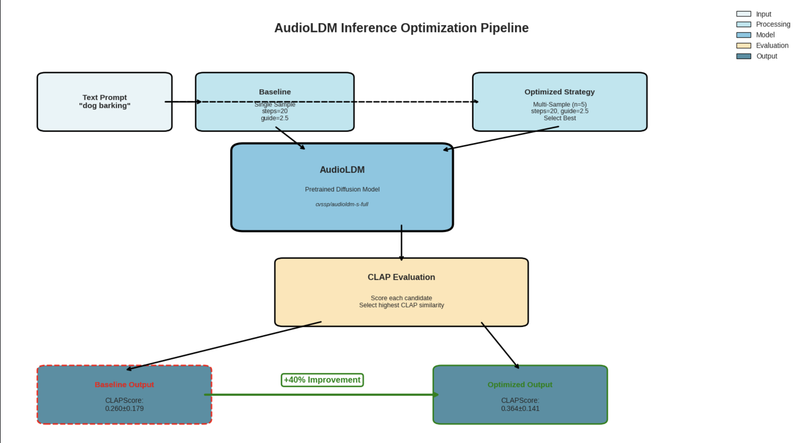

# 🎧 CLAP-Guided Multi-Sample Selection for AudioLDM (Text-to-Audio)

  
  
  
  
  
  

## Overview
This project improves **Text-to-Audio generation reliability** for diffusion-based models by using a simple but effective **inference-time optimization** strategy:

1) Generate **n** candidate audio clips per prompt using **AudioLDM**  
2) Score each candidate with **CLAP** (text–audio alignment)  
3) Select the **highest-scoring** candidate as the final output  

This approach requires **no fine-tuning** or model retraining and targets the real-world problem of **high variance** in generative audio quality.

## Key Results (from report)
- **CLAPScore improves ~40%** at **n = 5** samples (baseline → best-of-5 selection)
- Clear **diminishing returns** beyond ~7 samples
- Includes qualitative + spectrogram comparisons and cost–benefit analysis

## Repository Contents
- `notebooks/AudioLDM_FINAL.ipynb` — end-to-end implementation (Colab workflow)
- `docs/Enhancing_Text_to_Audio_Generation.pdf` — final paper/report
- `docs/AudioLDM_Presentation.pptx` — presentation deck
- `assets/` — figures (architecture, methodology, spectrograms, analysis plots)

## Method (High Level)
**Baseline:** 1 sample per prompt  
**Optimized:** generate n samples → CLAP score each → pick best

  

## How to Run (Recommended: Google Colab)
1. Open `notebooks/AudioLDM_FINAL.ipynb` in Colab  
2. Set runtime to **GPU (A100 recommended)**  
3. Run cells in order  
4. Provide/point to an AudioCaps-compatible dataset (or a subset)  

> Note: datasets and checkpoints are intentionally not included in this repo.

## Outputs
- Spectrogram comparisons  
- Qualitative comparison plots  
- Ablation-style comparisons  
- Cost vs. quality tradeoff chart  

## Skills Demonstrated
- Inference-time optimization for diffusion models  
- Cross-modal scoring using CLAP (text–audio alignment)  
- Experimental evaluation + cost–benefit analysis  
- Reproducible research workflow and reporting  

## Future Work
- Combine selection with parameter sweeps (guidance/steps)
- Add diversity constraints (avoid selecting near-duplicates)
- Human evaluation study alongside CLAPScore

## Author
**Krishna Koushik Unnam** — University of South Florida  